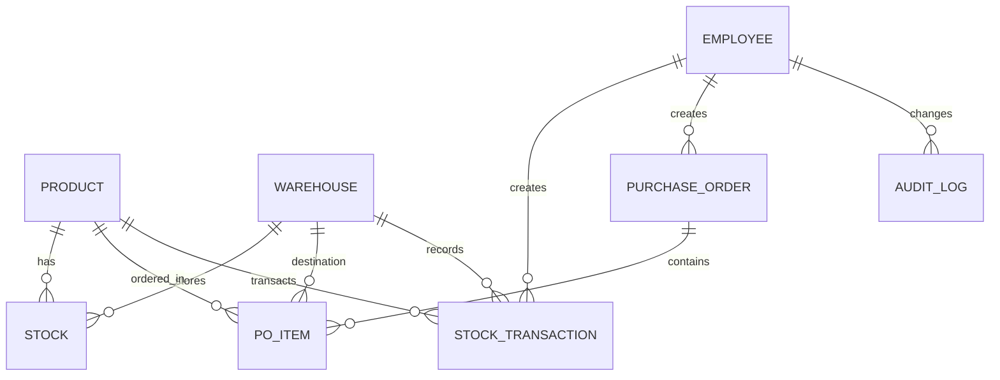
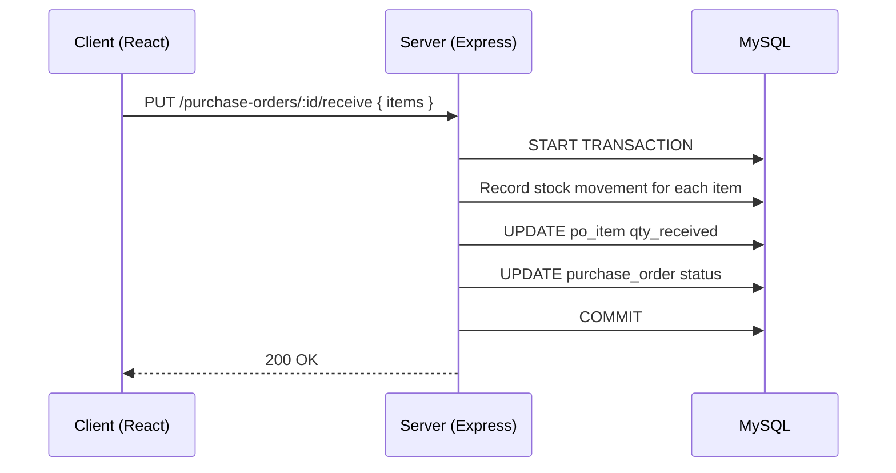

# IMS Pro — Project Report

## Report Metadata
- **Project Title:** IMS Pro (Inventory Management System)
- **Document Type:** Project Report
- **Version:** Updated
- **Generated:** May 17, 2026

## 1. Abstract
IMS Pro is a full-stack inventory management system for small-to-medium businesses. It supports multi-warehouse stock tracking, purchase-order lifecycle management, role-based access control, audit logging, and reporting dashboards. The solution is implemented with Node.js/Express + Sequelize/MySQL on the backend and React on the frontend.

## 2. Introduction
### 2.1 Background
Inventory operations require reliable stock visibility, controlled purchase flow, and traceable updates. IMS Pro addresses these needs with centralized product, warehouse, stock, and transaction management.

### 2.2 Objectives
- Maintain accurate, auditable inventory records.
- Support PO lifecycle: create → approve → receive.
- Enable role-based operations (Admin, Manager, Staff, Viewer).
- Provide reporting and low-stock visibility for decision-making.

### 2.3 Reference Template
[Updated-SDA-LAB-MANUAL-SPR-2026-14052026-090546am.docx](https://github.com/user-attachments/files/27898688/Updated-SDA-LAB-MANUAL-SPR-2026-14052026-090546am.docx)

## 3. System Overview
### 3.1 Key Features
- Product/category management
- Multi-warehouse stock tracking
- Stock transactions (`IN`, `OUT`, `ADJUSTMENT`, `TRANSFER`)
- Purchase order workflow with partial receiving
- Audit logging for critical operations
- Dashboard and low-stock alerts

### 3.2 User Roles
- **Admin:** Full access and master-data control
- **Manager:** PO approvals and reports
- **Staff:** Receiving, stock updates, fulfillment actions
- **Viewer:** Read-only operational visibility

## 4. Architecture and Design
### 4.1 Client–Server–Database Flow
- React client sends HTTP requests to Express REST APIs.
- Backend validates and executes business logic through service/repository layers.
- MySQL stores normalized data and enforces consistency.

### 4.2 Database Technology
- **DBMS:** MySQL 8.0 (InnoDB)
- **Reasoning:** Relational design fits product/warehouse/order entities; transaction support ensures consistency.

### 4.3 Core Tables
- `product`, `category`
- `warehouse`, `stock`, `stock_transaction`
- `purchase_order`, `po_item`
- `employee`, `audit_log`

### 4.4 ER Diagram

### 4.5 Sequence: Receive Purchase Order

## 5. Implementation Summary
### 5.1 Technology Stack
- **Backend:** Node.js, Express, Sequelize, MySQL
- **Frontend:** React, react-router
- **Security/Auth:** JWT, bcrypt
- **Logging:** Winston
- **Testing:** Jest

### 5.2 Implemented Functionalities
- Product CRUD and validation
- Stock aggregation and low-stock detection
- Purchase order lifecycle with partial receives
- Audit logging for create/update/delete
- Report and analytics endpoints

## 6. Screenshots / Evidence
> All previously provided README images are retained below.

## 7. Testing and Validation
### 7.1 Approach
- UI workflow checks (PO create → approve → receive)
- Backend service-level tests with Jest
- DB-level validation of transaction and stock consistency

### 7.2 Representative Cases
- Full receive updates stock correctly
- Partial receive updates PO state correctly
- Validation prevents invalid operations
- Audit logs capture critical changes

## 8. Conclusion
IMS Pro delivers a practical inventory solution with traceability, multi-warehouse support, and role-aware operations. The architecture is modular and extendable for future additions like notifications, automated reconciliation, and advanced forecasting.

## 9. References
- Project source: `/backend` and `/frontend`
- Common ERP/IMS workflow concepts

---
Generated: May 17, 2026
