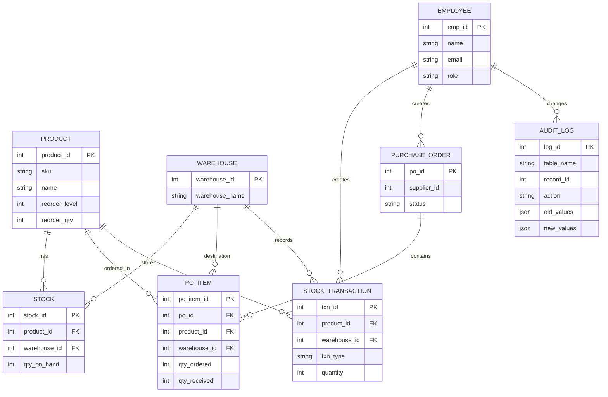
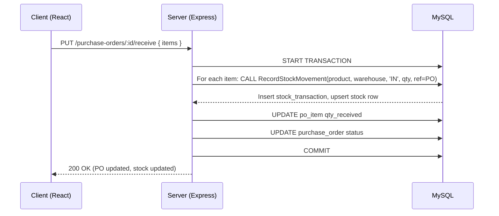

# IMS Pro — Inventory Management System

IMS Pro is a full‑stack inventory management application that supports multi‑warehouse stock tracking, purchase order lifecycle, role‑based access, audit logging and reporting.

[DBMS-Project-Report-Template-06052026-120106pm.docx](https://github.com/user-attachments/files/27491024/DBMS-Project-Report-Template-06052026-120106pm.docx)

## 1. Introduction

- **Project Background:** This Inventory Management System (IMS) is a web application to manage products, warehouses, stock levels, purchase orders and audit logs for a small-to-medium business. The system tracks stock transactions with ACID guarantees (via a stored procedure), supports multi-warehouse inventories, and provides role-based user management.
- **Reference Application:** The project is inspired by common ERP/IMS applications (inventory modules in systems like Odoo or NetSuite), but implemented as a lightweight custom stack using Node.js/Express, Sequelize ORM and MySQL on the backend, and React on the frontend.
- **Project Objectives:**
  - Provide accurate, auditable inventory tracking across multiple warehouses.
  - Support purchase order lifecycle (create → approve → receive) and automatic stock updates.
  - Offer role-based UI for Admin / Manager / Staff / Viewer.
  - Maintain a complete audit trail for critical operations.

## 2. System Overview

- **Key Features:**
  - Product and category management
  - Multi-warehouse stock tracking with per-warehouse `stock` rows
  - Stock transactions recorded in `stock_transaction` (IN, OUT, ADJUSTMENT, TRANSFER)
  - Purchase order workflow: create → approve → receive (partial receives supported)
  - Audit logging for create/update/delete across important tables
  - Dashboard and low-stock alerting

- **User Roles:**
  - Admin: full permissions, manage data and view all audit logs
  - Manager: create/approve POs, view reports
  - Staff: receive goods, adjust stock, fulfill orders
  - Viewer: read-only reporting access

## 3. Design Approach (Client–Database Interaction)

- **Role of the client application:**
  - React SPA sends HTTP requests (GET/POST/PUT) to backend REST API endpoints.
  - Client handles presentation, user actions (create PO, receive goods, adjust stock) and presents feedback (toasts, modals).

- **Role of the database server:**
  - MySQL stores normalized tables (product, stock, stock_transaction, purchase_order, po_item, audit_log, employee, warehouse).
  - Critical stock updates use a stored procedure `RecordStockMovement` to ensure ACID semantics (transactions + upsert behavior) and prevent negative stock.

- **Data flow direction:**
  - Client → Backend API → Database (execute queries / stored procedures) → Backend returns result → Client displays updates.

- **Basic interaction examples:**
  - **Insert (create product):**
    - Client: `POST /api/v1/products { name, sku, reorder_level }`
    - Server: validate → `Product.create(...)` → `audit_log` INSERT
    - Client: show success
  - **Update (receive goods for PO):**
    - Client: `PUT /api/v1/purchase-orders/:id/receive { items }`
    - Server: `purchaseOrderService.receiveGoods(id, items)` → calls stored procedure per item:
      - `CALL RecordStockMovement(product_id, warehouse_id, 'IN', qty, ref_id=PO)`
      - Insert `stock_transaction` and upsert `stock` row
      - Update PO item `qty_received` and PO status
    - Client: show success and refresh stock/PO
  - **Fetch (low stock list):**
    - Client: `GET /api/v1/stock/alerts/low-stock`
    - Server: `stockRepo.findLowStock()` raw query returns aggregated view
    - Client: display low-stock tab

## 4. Database Design

- **Database Type:** MySQL 8.0 (InnoDB)
- **Justification:**
  - Relational schema fits inventory domain (normalized product/warehouse relationships).
  - MySQL stored procedures allow encapsulating ACID stock movement logic (locks, upserts, negative-stock guard).
  - Sequelize ORM provides maintainable server-side model mapping.

- **Schema Overview (main tables):**
  - `product` (product_id PK, sku, name, reorder_level, reorder_qty, is_active)
  - `warehouse` (warehouse_id PK, warehouse_name, location)
  - `stock` (stock_id PK, product_id FK, warehouse_id FK, qty_on_hand, last_updated)
  - `stock_transaction` (txn_id PK, product_id, warehouse_id, txn_type, quantity, ref_id, notes, created_by, txn_date)
  - `purchase_order` (po_id PK, supplier_id, order_date, expected_date, status)
  - `po_item` (po_item_id PK, po_id FK, product_id FK, warehouse_id, qty_ordered, qty_received)
  - `employee` (emp_id PK, name, email, password_hash, role, warehouse_id)
  - `audit_log` (log_id PK, table_name, record_id, action, old_values JSON, new_values JSON, changed_by, changed_at)

- **ER Diagram (Mermaid):**

- **Sample Table Structure (`product`):**

| Column        | Type          | Notes            |
|---------------|---------------|------------------|
| product_id    | INT (PK)      | Auto-increment   |
| sku           | VARCHAR(50)   | Unique           |
| name          | VARCHAR(200)  | Not null         |
| unit_price    | DECIMAL(10,2) | Not null         |
| reorder_level | INT           | Default 10       |
| reorder_qty   | INT           | Default 50       |
| is_active     | BOOLEAN       | Default true     |

## 5. Client–Database Sequence

## 6. Implementation

- **Tools & Technologies:**
  - Backend: Node.js, Express, Sequelize, MySQL
  - Frontend: React, react-router, Tailwind CSS
  - Auth: JWT, bcrypt
  - Logging: Winston
  - Testing: Jest (backend unit tests)

- **Functionalities Developed:**
  - Product CRUD and validation
  - Stock aggregation and low-stock detection
  - Purchase order lifecycle with partial receives
  - ACID stock movement stored procedure (`RecordStockMovement`)
  - Audit logging for critical table changes
  - Employee management with admin password reset

## SS

https://github.com/user-attachments/assets/9c82b46e-a6b1-4445-9aea-4e702b562c51

## 7. Testing

- **Testing Approach:**
  - Manual testing of UI workflows (create PO → approve → receive)
  - Backend unit tests for services using Jest
  - DB checks using diagnostic scripts to validate `RecordStockMovement` and rebuilt stock from history

- **Key Test Cases:**
  - Create PO and receive full quantity → stock increases correctly
  - Partial receive → PO becomes `PARTIALLY_RECEIVED` and subsequent receives update correctly
  - Stock adjustment negative guard → prevent operations that would cause negative stock
  - Employee registration shows validation errors
  - Audit logs created for create/update/delete operations

- **Results & Bug Fixes:**
  - Fixed `RecordStockMovement` stored procedure (it recorded transactions but did not upsert `stock` rows) — now fixed and validated
  - Rebuilt stock from transaction history where required
  - Fixed frontend JSX error in `EmployeesPage.js`

## 8. Conclusion

- **Summary:** The IMS provides robust inventory control with a traceable audit trail, multi-warehouse support and a complete PO→Receive workflow. Stored procedure-based stock updates guarantee ACID behavior for concurrent operations.
- **Challenges:**
  - Stored-procedure correctness and ensuring `stock` rows are upserted reliably
  - Proper mapping between transaction history and aggregated stock
- **Future Work:**
  - Add scheduled background job to reconcile transactions and detect discrepancies
  - Add notifications/email for low-stock alerts
  - Add role-based audit filters and exportable audit reports

## 9. References

- The reference application ideas were taken from common ERP inventory modules (e.g., Odoo, NetSuite) and standard inventory management patterns.
- Project source code: project root files under this workspace (`backend` + `frontend`)

---

Generated: May 7, 2026
