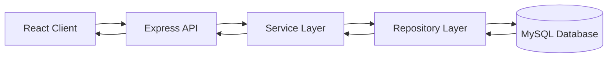
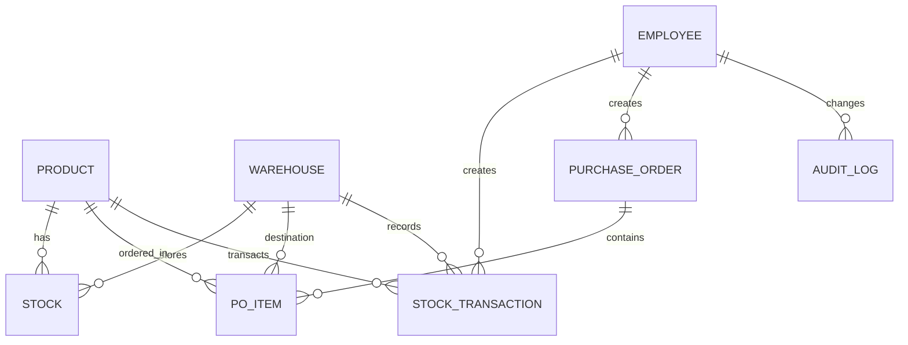

# IMS Pro — Simple Semester Project Report

## 1. Title Page
- **Project Title:** IMS Pro (Inventory Management System)
- **Student Name(s):** _To be filled by student_
- **Course Name & Code:** _To be filled by student_
- **Instructor’s Name:** _To be filled by student_
- **Date:** May 17, 2026

## 2. Introduction
- **Project Background:**
  IMS Pro is a web-based inventory management system developed to manage products, warehouses, stock levels, purchase orders, and audit logs for small-to-medium businesses. It improves inventory visibility and operational control through a centralized platform.

- **Reference Application:**
  The project is inspired by common ERP inventory modules (such as Odoo/NetSuite-style workflows) and adapted into a lightweight full-stack implementation.

- **Project Objectives:**
  - Maintain accurate and auditable stock records.
  - Support purchase order lifecycle (create → approve → receive).
  - Implement role-based access for Admin, Manager, Staff, and Viewer.
  - Provide reports and low-stock insights for decision-making.

## 3. System Overview
- **Key Features:**
  - Product and category management
  - Multi-warehouse stock tracking
  - Stock transactions (`IN`, `OUT`, `ADJUSTMENT`, `TRANSFER`)
  - Purchase order workflow with partial receiving
  - Audit logging for critical operations
  - Reports and dashboard analytics

- **User Roles:**
  - **Admin:** Full system access and data management
  - **Manager:** Approvals, monitoring, and reporting
  - **Staff:** Receiving, stock updates, and fulfillment actions
  - **Viewer:** Read-only access to operational data

## 4. Architectural Style
- **Selected Style:**
  Layered Client-Server architecture (React frontend client + Express service layer + MySQL database).

- **Justification:**
  This style was selected because it separates concerns clearly (UI, business logic, data access), improves maintainability, and supports scalable feature additions.

- **Diagram:**

## 5. Database Design
- **Database Type:**
  MySQL 8.0 (InnoDB)

- **Schema Overview:**
  Main entities/tables:
  - `product` (product_id, sku, name, reorder_level, reorder_qty)
  - `warehouse` (warehouse_id, warehouse_name, location)
  - `stock` (stock_id, product_id, warehouse_id, qty_on_hand)
  - `stock_transaction` (txn_id, product_id, warehouse_id, txn_type, quantity)
  - `purchase_order` (po_id, supplier_id, status)
  - `po_item` (po_item_id, po_id, product_id, qty_ordered, qty_received)
  - `employee` (emp_id, name, email, role)
  - `audit_log` (log_id, table_name, action, changed_at)

- **ER Diagram:**

- **Sample Table Structure:**

| Column        | Data Type      | Key/Constraint |
|---------------|----------------|----------------|
| product_id    | INT            | PK, Auto Increment |
| sku           | VARCHAR(50)    | UNIQUE, NOT NULL |
| name          | VARCHAR(200)   | NOT NULL |
| reorder_level | INT            | DEFAULT 10 |
| reorder_qty   | INT            | DEFAULT 50 |
| is_active     | BOOLEAN        | DEFAULT TRUE |

## 6. Design Patterns

| # | Pattern | Category | Purpose | Implementation Status |
|---|---------|----------|---------|------------------------|
| 1 | Repository | Architectural | Data access abstraction | ✅ Repository classes in backend |
| 2 | Strategy | Behavioral | Pluggable algorithms | ✅ Stock valuation strategy layer |
| 3 | Command | Behavioral | Encapsulate actions | ✅ Inventory command objects |
| 4 | Observer | Behavioral | Event-driven notifications | ✅ Domain event bus/listeners |
| 5 | Factory | Creational | Create channel-specific notifiers | ✅ Notification factory |
| 6 | Facade | Structural | Unified cross-module interface | 🟡 Partial: inventory/report aggregation exists; unified PO+stock+notification facade is pending |
| 7 | Builder | Creational | Fluent object construction | ✅ Report query builder |
| 8 | Adapter | Structural | Normalize incompatible inputs | ✅ Product import adapter |

**Summary:**  
The IMS implementation uses structural, behavioral, and creational patterns to keep business logic modular and maintainable.

### Architecture & Domain Highlights

| # | Feature | Category | Purpose | Implementation Status |
|---|---------|----------|---------|------------------------|
| 1 | Real-Time/SSE | Architectural | Live data updates | ✅ EventSource-based stock updates |
| 2 | Dynamic UML | Architectural | Auto-generate architecture diagrams | ✅ Mermaid-based reverse UML |
| 3 | Bin/Batch/Serial Tracking | Domain | Enterprise-grade inventory traceability | ✅ Implemented in stock and stock-transaction workflows |

## 7. Implementation
- **Tools & Technologies:**
  - Backend: Node.js, Express, Sequelize, MySQL
  - Frontend: React, react-router
  - Authentication/Security: JWT, bcrypt
  - Logging: Winston
  - Testing: Jest

- **Functionalities Developed:**
  - Product CRUD and validation
  - Stock aggregation and low-stock detection
  - Purchase order lifecycle with partial receives
  - Audit logging for create/update/delete operations
  - Reporting and analytics endpoints

- **Screenshots:**
  (All images previously present in README are retained below.)

## 8. Testing
- **Testing Approach:**
  - Manual testing of key UI workflows
  - Automated backend service tests with Jest

- **Test Cases:**
  - Full receive updates stock correctly
  - Partial receive updates PO status correctly
  - Validation blocks invalid inputs/operations
  - Audit logs are generated for critical actions

- **Results:**
  Core modules were validated for expected behavior; identified issues during development were fixed through iterative testing and re-verification.

## 9. Conclusion
- **Summary:**
  IMS Pro achieves a role-based, auditable inventory workflow with multi-warehouse tracking and PO lifecycle support.

- **Challenges:**
  - Ensuring stock consistency during transactional updates
  - Coordinating PO state transitions with stock updates

- **Future Work:**
  - Notification/email alerts for low stock
  - Advanced analytics and exportable reports
  - Automated reconciliation and forecasting support

## 10. References
- ERP/IMS workflow references (Odoo/NetSuite-style inventory concepts)
- Project source code: `/backend` and `/frontend`
- Template context provided by issue discussion
